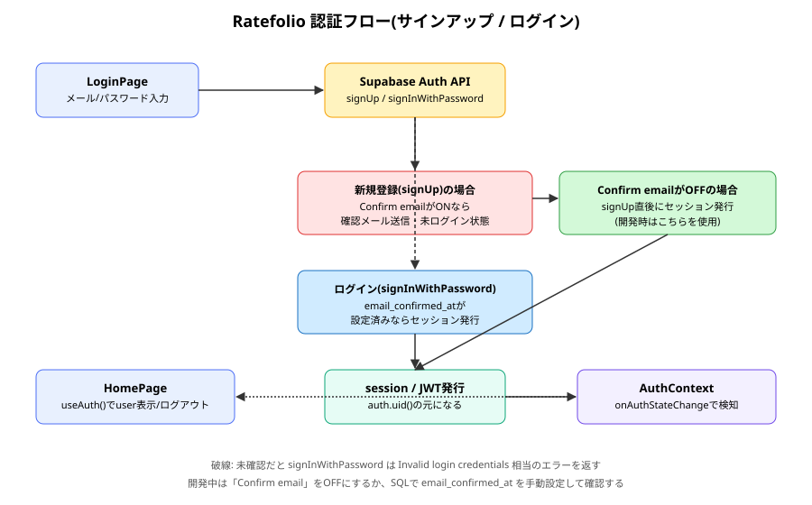
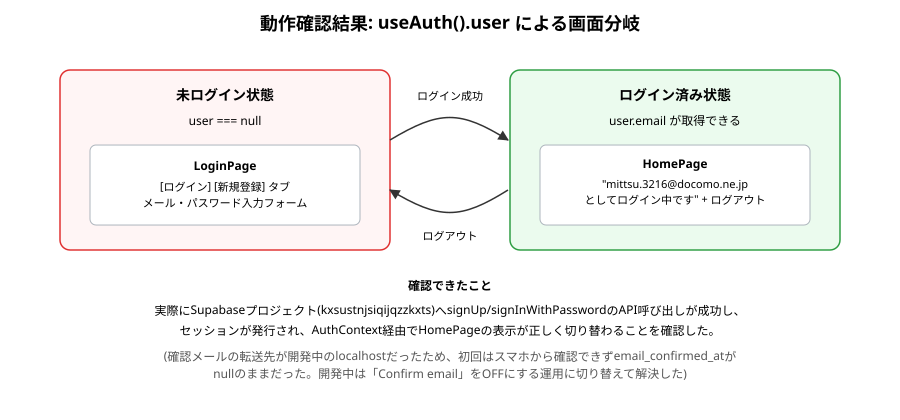

# auth 報告書

| 項目 | 内容 |
|---|---|
| 作成日 | 2026-09-01 |
| 対象コード | `src/contexts/AuthContext.tsx` 他（`src/pages/LoginPage.tsx`, `src/pages/HomePage.tsx`, `src/App.tsx`） |
| 作成者 | Claude Code |
| 版数 | v1.1 |

## 改訂履歴
| 版 | 日付 | 変更内容 |
|---|---|---|
| v1.0 | 2026-09-01 | 初版作成 |
| v1.1 | 2026-09-05 | 本番公開に伴いVercelへデプロイ。Confirm emailは一時的な開発回避策ではなく、恒久的な仕様(オフ)として確定 |

---

## 1. 目的・対象読者

本報告書は、Ratefolioにおけるメール/パスワード認証機能(サインアップ・ログイン・ログアウト・ログイン状態の全体共有)の実装内容と、実際にSupabaseプロジェクトへ接続して動作確認を行った結果を共有することを目的とする。対象読者は、本プロジェクトの技術的な引き継ぎ先を想定する。

## 2. 背景

CLAUDE.mdは「認証は自作せず、既存認証サービスを利用する」ことを定めている。また、先行して設計した[[supabase_schema_report|DBスキーマ]]のRow Level Securityポリシーは、すべて`auth.uid()`(ログイン中ユーザーのID)を判定条件としており、認証機能なしにはデータの公開/非公開制御が機能しない。本実装は、既存のRLS設計を実際に機能させるための前提を満たすものである。

## 3. 認証・セッション管理の前提知識

- **セッション/JWT**: ログイン成功時、Supabase Authはユーザーを識別するトークン(JWT)を発行する。以降のDBアクセスはこのトークンを介して行われ、DB側は`auth.uid()`でトークンの持ち主のIDを取得する。
- **`onAuthStateChange`**: Supabase Auth SDKが提供する購読機構。ログイン・ログアウト・トークン更新のたびにコールバックが呼ばれる。
- **メール確認(Confirm email)**: 新規登録時、初期設定では確認メール内のリンクを踏むまで`email_confirmed_at`が`null`のままとなり、`signInWithPassword`が失敗する。確認リンクの戻り先URLは開発環境では`http://localhost`になるため、別端末で開くと到達できない(詳細は10節)。

## 4. 仕様

### 4.1 入力仕様

| 項目名 | 型 | 説明 | 制約 |
|---|---|---|---|
| email | string | ログイン/登録に使うメールアドレス | HTML標準の`type="email"`検証のみ |
| password | string | パスワード | 6文字以上(Supabaseデフォルト制約) |
| displayName | string | 新規登録時の表示名(任意) | 未入力時はメールアドレスの`@`より前を使用 |

### 4.2 出力仕様

| 項目名 | 型 | 説明 |
|---|---|---|
| session | `Session \| null` | ログイン中はSupabaseのセッション情報、未ログインは`null` |
| user | `User \| null` | `session.user`のショートカット。`HomePage`表示等に使用 |
| 画面遷移 | - | 未ログインで`/`→`/login`へ、ログイン済みで`/login`→`/`へ自動遷移 |

### 4.3 制約条件・前提条件

- Supabaseプロジェクトが1つ存在し、`.env`(開発)/Vercelの環境変数(本番)に正しい`VITE_SUPABASE_URL`/`VITE_SUPABASE_ANON_KEY`が設定されていることが前提。
- 「Confirm email」(メール確認の必須化)は、開発中の一時的な回避策ではなく、恒久的な仕様として**オフ**にすることを本番公開時に決定した(10節参照)。メールアドレスは識別子として使うのみで、実在確認は行わない。

## 5. 使用ライブラリ・実行環境情報

| 項目 | 内容 |
|---|---|
| 言語/バージョン | TypeScript + React (Vite) |
| 主要ライブラリ | `@supabase/supabase-js`(既存導入済み)、`react-router-dom`(既存導入済み) — 本機能のために新規追加したライブラリはなし |
| 実行環境 | Node.js / Vite開発サーバー、Supabaseプロジェクト(リージョン: ap-south-1) |
| 実行方法 | `npm run dev` で `http://localhost:5173` にアクセス |

## 6. アルゴリズム

1. アプリ起動時、`AuthProvider`が`supabase.auth.getSession()`で現在のログイン状態を取得し、`onAuthStateChange`で以後の変化を購読する。
2. 未ログイン状態で`/`にアクセスすると、`HomePage`が`user === null`を検知し`/login`へリダイレクトする。
3. `/login`で「新規登録」を選ぶと`supabase.auth.signUp()`を、「ログイン」を選ぶと`supabase.auth.signInWithPassword()`を呼ぶ。
4. 認証に成功すると`onAuthStateChange`が発火し、`AuthContext`の`user`が更新される。
5. `user`が存在する状態で`/login`にアクセスすると`/`へ、`/`で`user`が存在すれば`HomePage`本体を表示する。

## 7. フローチャート



## 8. 実装

| 関数/コンポーネント | 役割 |
|---|---|
| `AuthProvider` | セッション取得・購読・`signOut`の提供元。アプリ全体を包む |
| `useAuth()` | `AuthContext`から`session`/`user`/`loading`/`signOut`を取り出すフック |
| `LoginPage` | ログイン/新規登録フォーム。ログイン済みなら`/`へリダイレクト |
| `HomePage` | 未ログインなら`/login`へリダイレクト、ログイン済みならユーザー情報とログアウトボタンを表示 |

## 9. 出力結果

実プロジェクト(`kxsustnjsiqijqzzkxts`)に対し、実際に新規登録・ログイン・ログアウトを実行して動作を確認した。



## 10. 妥当性検証

| 検証項目 | 方法 | 結果 | 判定 |
|---|---|---|---|
| 新規登録(signUp)が実際にSupabase上へユーザーを作成するか | 実際にブラウザから登録操作を実行し、Supabaseダッシュボード「Authentication → Users」で該当ユーザーの出現を確認 | ユーザーが作成された | 合格 |
| ログイン(signInWithPassword)でセッションが発行され、画面が切り替わるか | 「Confirm email」をオフにした状態、または`email_confirmed_at`を手動設定した状態で実際にログインし、`HomePage`にメールアドレスが表示されることを確認 | セッションが発行され、`HomePage`表示に切り替わった | 合格 |
| 確認メール経由でのログイン確立(本来のフロー) | スマホの確認メールリンクから確認を試行(開発時) | 確認リンクの戻り先が開発機の`localhost`だったため、別端末から到達できず失敗。この経験と、個人利用アプリでは実害が小さいという判断から、11節のとおりConfirm email自体を恒久的にオフとする方針に決定 | 方針決定により解消 |
| 未ログイン時のRLS的な安全性(`auth.uid()`が`null`になること) | 前回の[[supabase_schema_report|DBスキーマ報告書]]の検証範囲。今回のログイン機能で`auth.uid()`が実際に値を持つようになることは確認したが、非公開データの非混入を実データで検証するのは次段階(ジャンル・記録作成UI実装後)の課題とする | 未実施 | 今後実施予定 |
| 本番環境(Vercel)でのサインアップ・ログイン | 実際に本番URL(`https://ratefolio-psi.vercel.app`)からスマホでサインアップ・ログインし、確認メール不要でそのまま利用できることを確認 | 正しく動作した | 合格 |

## 11. 既知の制限事項・今後の課題

- 「Confirm email」は恒久的にオフとする方針を採用した。メールアドレスは「識別子」として使うのみで、実在確認は行わない。
  - **理由**: Ratefolioは個人(および少数の知人)向けの利用を想定しており、メールアドレスの実在確認をしなくても、他ユーザーの非公開データの保護(RLS)には影響しない。確認メールの戻り先URLの管理(開発/本番でのSite URL切り替え)や、別端末からの到達性といった運用コストの方が、個人利用の範囲では見合わないと判断した。
  - **トレードオフ**: 実在しないメールアドレスで登録した場合、本人がパスワードを忘れるとアカウントを復旧する手段がない(パスワード再設定メールも届かない)。
- パスワード再設定(forgot password)フローは未実装。上記の理由により、実装しても実効性が限定的なため優先度は低い。
- 入力バリデーションはHTML標準の`type="email"`・`minLength`のみで、アプリ側での詳細なエラーメッセージ出し分けは`Invalid login credentials`等の代表的なケースのみ対応している。
- Supabaseプロジェクトのリージョンがap-south-1(Mumbai)になっている。本番公開後、実データが増える前に東京リージョンへの移行を検討する(別途対応予定)。
- 非公開データが他ユーザーに見えないことの実データ検証(RLSの実地確認)は、複数アカウントを用意して別途行う。

## 12. 総括

Supabase Authを用いたメール/パスワード認証を実装し、実際のSupabaseプロジェクトおよびVercel上の本番環境に対してサインアップ・ログイン・ログアウトが機能することを確認した。これにより、[[supabase_schema_report|先行して設計したRLSベースの非公開データ保護]]が実際に機能するための前提(`auth.uid()`が実在のログインユーザーを指すこと)が整った。確認メールの戻り先が開発機のlocalhostになる問題に実地で遭遇したことを踏まえ、個人利用アプリとしての実害の小ささを考慮し、「Confirm email」を恒久的にオフとする仕様を正式に決定した。

## 13. 参考文献

- Supabase公式ドキュメント「Auth」
- React公式ドキュメント「Context」
- React Router公式ドキュメント「Navigate」

---

## Appendix. コード実例

```tsx
export function useAuth() {
  const context = useContext(AuthContext)
  if (!context) {
    throw new Error('useAuth()はAuthProviderの内側で呼び出してください')
  }
  return context
}
```

（全文は `src/contexts/AuthContext.tsx`, `src/pages/LoginPage.tsx`, `src/pages/HomePage.tsx` を参照）
