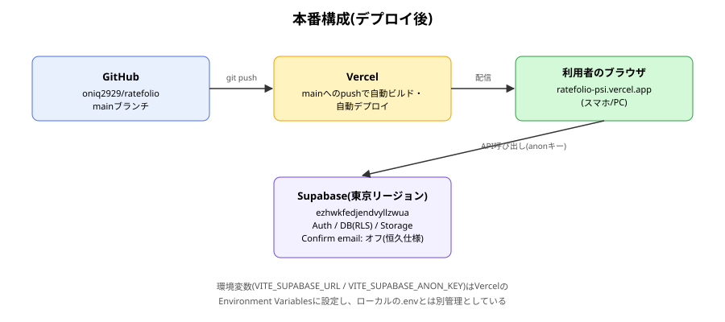

# deploy 報告書

| 項目 | 内容 |
|---|---|
| 作成日 | 2026-09-05 |
| 対象コード | なし(GitHub/Vercel/Supabaseの設定作業) |
| 作成者 | Claude Code |
| 版数 | v1.0 |

## 改訂履歴
| 版 | 日付 | 変更内容 |
|---|---|---|
| v1.0 | 2026-09-05 | 初版作成 |

---

## 1. 目的・対象読者

本報告書は、Ratefolioの本番環境デプロイ(Vercel)、およびSupabaseプロジェクトのリージョン移行(ムンバイ→東京)の作業内容と結果を共有することを目的とする。対象読者は、本プロジェクトの技術的な引き継ぎ先を想定する。

## 2. 背景

主要機能・デザインテーマの実装が完了し、本番公開が可能な段階に達した。また、以前から課題として残っていたSupabaseプロジェクトのリージョン(ap-south-1、Mumbai)について、実データが増える前の今のタイミングで東京リージョンへ移行することとした([[supabase_schema_report|関連メモ]]参照)。

## 3. 前提知識

- **継続的デプロイ**: GitHubへのpushをトリガーに、Vercelが自動でビルド・公開を行う仕組み。
- **環境変数のホスティング側設定**: `.env`はgit管理外のため、ホスティングサービス(Vercel)側にも同じ内容を別途設定する必要がある。

## 4. 仕様

### 4.1 本番構成

| 項目 | 内容 |
|---|---|
| フロントエンドホスティング | Vercel(Hobbyプラン) |
| リポジトリ | `github.com/oniq2929/ratefolio`(Private) |
| 本番URL | `https://ratefolio-psi.vercel.app` |
| デプロイトリガー | `main`ブランチへのpush |
| バックエンド | Supabase(プロジェクトID: `ezhwkfedjendvyllzwua`、東京リージョン) |

### 4.2 環境変数

| 変数名 | 設定箇所 |
|---|---|
| VITE_SUPABASE_URL | ローカル`.env` / Vercel Environment Variables(Production, Preview) |
| VITE_SUPABASE_ANON_KEY | ローカル`.env` / Vercel Environment Variables(Production, Preview) |

### 4.3 制約条件・前提条件

- 旧Supabaseプロジェクト(Mumbai)はテストデータのみのため、データ移行は行わず新規プロジェクト作成による作り直しとした。
- Supabase Auth側の「Confirm email」は、[[auth_report|認証報告書]]の方針決定に基づき、本番でも恒久的にオフとしている。

## 5. 使用ライブラリ・実行環境情報

| 項目 | 内容 |
|---|---|
| 言語/バージョン | TypeScript + React (Vite) |
| 主要ライブラリ | なし(新規ライブラリの追加はなし) |
| 実行環境 | Vercel(ビルド・ホスティング)、Supabase(DB/Auth/Storage、東京リージョン) |
| 実行方法 | `git push origin main` で自動デプロイ。手動再デプロイは Vercel ダッシュボードの「Redeploy」 |

## 6. アルゴリズム

1. GitHubに空のリポジトリを作成し、ローカルリポジトリをpushする。
2. VercelをGitHubアカウントと連携し、リポジトリをインポートしてデプロイする(初回、環境変数を設定)。
3. 新しいSupabaseプロジェクトを東京リージョンで作成し、既存のマイグレーションSQL(`0001_init.sql`, `0002_formulas.sql`)を実行する。
4. Vercelの環境変数を新しいSupabaseプロジェクトの接続情報に更新し、再デプロイする。
5. 新しいSupabaseプロジェクトのAuth設定(Confirm emailオフ、Site URL/Redirect URLsを本番ドメインに設定)を行う。
6. 本番URLで、新規登録からレーダーチャート表示・公開一覧までの一連の動作を実機で確認する。

## 7. フローチャート

## 8. 実装

本機能はアプリケーションコードの変更を伴わず、GitHub/Vercel/Supabaseダッシュボード上の設定作業が中心である。該当するアプリケーションコードは、環境変数を読み込む`src/lib/supabase.ts`(既存)のみ。

## 9. 出力結果

本番URL(`https://ratefolio-psi.vercel.app`)にスマホからアクセスし、新規登録・ログイン・ジャンル作成・記録作成(レーダーチャート表示)・公開一覧の閲覧までの一連の流れが、東京リージョンの新Supabaseプロジェクトに対して問題なく動作することを確認した。

## 10. 妥当性検証

| 検証項目 | 方法 | 結果 | 判定 |
|---|---|---|---|
| GitHubへのpush | 実際に`git push`を実行 | 成功(ブラウザ認証が必要だったため、ユーザー自身のターミナルで実行) | 合格 |
| Vercelへの初回デプロイ | 実際にVercelダッシュボードからImport・Deployを実行 | 成功。プレビュー画像でテーマ(Field Notes)の反映も確認 | 合格 |
| 環境変数変更後の再デプロイ反映 | Environment Variablesを更新し、Redeployを実行 | 新しいSupabaseプロジェクトへの接続に切り替わったことを確認 | 合格 |
| 東京リージョンでのマイグレーション適用 | SQL Editorで両マイグレーションを実行 | 6テーブルが作成された(ユーザーによる目視確認) | 合格 |
| 本番URLでのAuth設定(Confirm email/Site URL) | 実際にスマホで新規登録し、確認メール不要でそのまま利用できることを確認 | 正しく動作した | 合格 |
| 本番環境での主要機能一式(ジャンル・記録・公開一覧) | 実機での一連の操作 | 問題なしとの報告を受領 | 合格 |

## 11. 既知の制限事項・今後の課題

- 旧Supabaseプロジェクト(Mumbai)は、動作確認完了後に削除する想定だが、本報告書作成時点では未削除(誤操作防止のため、ユーザーの明示的な判断を経てから削除する)。
- Vercelの2段階認証(2FA)は、シークレットキーの取り扱いに注意が必要なため、本作業では設定を見送っている。
- カスタムドメイン(独自ドメイン)の設定は未対応で、Vercelが割り当てた`vercel.app`サブドメインをそのまま使用している。
- PWA設定(マニフェスト・アイコン)は別タスクとして未対応。

## 12. 総括

GitHub + Vercelによる継続的デプロイ体制を構築し、Ratefolioを実際にインターネット上で利用可能な状態にした。あわせて、懸案だったSupabaseプロジェクトのリージョンをムンバイから東京へ移行し、本番URLに基づいた認証設定(Confirm emailの恒久方針含む)を完成させた。

## 13. 参考文献

- Vercel公式ドキュメント「Git Integrations」「Environment Variables」
- Supabase公式ドキュメント「Managing Environments」

---

## Appendix. 主要な接続情報

| 項目 | 値 |
|---|---|
| 本番URL | `https://ratefolio-psi.vercel.app` |
| GitHubリポジトリ | `github.com/oniq2929/ratefolio` |
| Supabaseプロジェクト(現行) | `ezhwkfedjendvyllzwua`(ap-northeast-1, Tokyo) |
| Supabaseプロジェクト(旧・削除予定) | `kxsustnjsiqijqzzkxts`(ap-south-1, Mumbai) |
