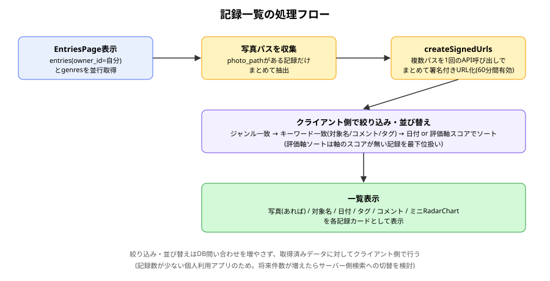
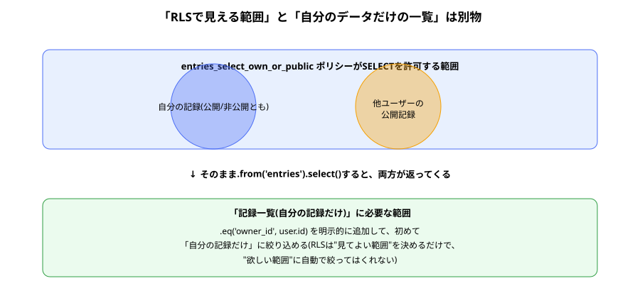

# entries_list 報告書

| 項目 | 内容 |
|---|---|
| 作成日 | 2026-09-02 |
| 対象コード | `src/pages/EntriesPage.tsx`, `src/components/AppLayout.tsx` |
| 作成者 | Claude Code |
| 版数 | v1.0 |

## 改訂履歴
| 版 | 日付 | 変更内容 |
|---|---|---|
| v1.0 | 2026-09-02 | 初版作成 |

---

## 1. 目的・対象読者

本報告書は、Ratefolioにおける記録一覧機能(ジャンル絞り込み・キーワード検索・日付/評価軸での並び替え)、および全画面共通のヘッダー(トップページへの導線)の実装内容を共有することを目的とする。対象読者は、本プロジェクトの技術的な引き継ぎ先を想定する。

## 2. 背景

これまでの機能は記録の作成のみであり、作成した記録を見返す手段がなかった。また、ユーザーから「特定の評価軸を基準に記録を並べたい」という要望、および実機確認時に「トップページへ戻る手段がない」という指摘があり、本機能で対応した。

## 3. データ取得・表示の前提知識

- [[entries_list_knowledge|説明書]]で詳述する「RLSは許可範囲であり、取得条件は別途指定が必要」という考え方。
- **署名付きURL**: 非公開のStorageオブジェクトを、期限付きで閲覧可能にするURL発行機能。

## 4. 仕様

### 4.1 入力仕様

| 項目名 | 型 | 説明 | 制約 |
|---|---|---|---|
| selectedGenreId | string | 絞り込み対象のジャンルID | 空文字は「すべて」 |
| keyword | string | キーワード検索文字列 | 対象名・コメント・タグを対象、大文字小文字を区別しない |
| sortMode | 'date_desc' \| 'date_asc' \| 'axis_desc' | 並び替え方法 | 'axis_desc'はジャンルを1つ選択時のみ有効 |
| sortAxisId | string | 並び替え基準の評価軸ID | sortModeが'axis_desc'のときのみ使用 |

### 4.2 出力仕様

| 項目名 | 型 | 説明 |
|---|---|---|
| visibleEntries | 配列 | 絞り込み・並び替え後の記録一覧 |
| photoUrls | Record\<path, url\> | 写真パスごとの署名付きURL(1時間有効) |

### 4.3 制約条件・前提条件

- 一覧に表示されるのは`owner_id = auth.uid()`の記録のみ(他ユーザーの公開記録は含めない)。
- 絞り込み・並び替えはすべてクライアント側の処理であり、DBへの追加問い合わせは発生しない。

## 5. 使用ライブラリ・実行環境情報

| 項目 | 内容 |
|---|---|
| 言語/バージョン | TypeScript + React (Vite) |
| 主要ライブラリ | `@supabase/supabase-js`、`react-router-dom`(いずれも既存導入済み) — 新規ライブラリの追加はなし |
| 実行環境 | Node.js / Vite開発サーバー、Supabaseプロジェクト |
| 実行方法 | `npm run dev` で `http://localhost:5173/entries` にアクセス(要ログイン) |

## 6. アルゴリズム

1. ログイン中ユーザーの`entries`(`owner_id`で絞り込み、`entry_scores`を埋め込み取得)と`genres`(`axes`を埋め込み取得)を並行して取得する。
2. 取得した記録のうち、写真パスを持つものをまとめて`createSignedUrls`に渡し、署名付きURLを一括発行する。
3. ジャンル選択・キーワード入力・並び替え条件の変更のたびに、取得済みデータに対してクライアント側で絞り込み・並び替えを行う(`useMemo`で再計算)。
4. 評価軸での並び替えを選んだ場合、各記録の該当軸スコアを取り出し、降順に並べる。スコアが見つからない記録は最下位として扱う。
5. 一覧を、写真(あれば)・対象名・日付・タグ・コメント・ミニレーダーチャート付きのカードとして表示する。
6. すべてのログイン必須ページを`AppLayout`(共通ヘッダー)でラップし、トップページへの導線とログアウトボタンをどの画面からも使えるようにする。

## 7. フローチャート





## 8. 実装

| 関数/コンポーネント | 役割 |
|---|---|
| `EntriesPage` | データ取得、絞り込み・並び替え状態の管理、一覧表示 |
| `AppLayout` | ログイン必須ページ共通のヘッダー(トップページ導線・ログアウト)を提供 |

## 9. 出力結果

実際に複数ジャンル・複数件の記録(写真付きを含む)を作成した状態で一覧を表示し、ジャンル絞り込み・キーワード検索・日付順/評価軸順の並び替えがいずれも正しく動作することを確認した。また、共通ヘッダーの導入により、どの画面からもトップページに戻れることを確認した。

## 10. 妥当性検証

| 検証項目 | 方法 | 結果 | 判定 |
|---|---|---|---|
| 自分の記録だけが一覧に表示されるか | コードレビュー(`.eq('owner_id', user.id)`の有無を確認)。複数アカウントでの実データ比較は未実施 | 実装上は自分の記録のみに絞り込まれている | 要実データでの複数アカウント確認 |
| ジャンル絞り込み・キーワード検索・並び替えが機能するか | 実際にブラウザで操作し、期待どおりの一覧になることを確認 | 正しく動作した | 合格 |
| 写真付き記録の一覧表示 | 実際に写真付きの記録を作成し、一覧に署名付きURL経由で表示されることを確認 | 正しく表示された | 合格 |
| 共通ヘッダーからトップページへ戻れるか | 実際に各画面からヘッダーのリンクを操作して確認 | 正しく遷移した | 合格 |

## 11. 既知の制限事項・今後の課題

- 署名付きURLの有効期限は60分。一覧画面を開いたまま長時間経過すると、画像が表示できなくなる可能性がある。将来的には期限切れ時の再取得処理を検討する。
- 検索・絞り込み・並び替えはクライアント側処理のため、記録件数が非常に多くなった場合はパフォーマンス上の課題になりうる。その場合はサーバー側検索への切り替えを検討する。
- 「自分の記録だけが表示されること」の実データでの複数アカウント検証は未実施(10節参照)。次の「公開一覧」機能の実装時にあわせて行う。
- 評価軸での並び替えで、該当スコアがない記録が無条件に最下位になる仕様は、ユーザーにとって理由が分かりにくい可能性がある。

## 12. 総括

自分の記録を一覧・絞り込み・検索・並び替えできる画面を実装した。RLSが許可する範囲と、画面が本来必要とするデータ範囲は別物であるという設計上の注意点を明文化し、`owner_id`による明示的な絞り込みを行った。また、非公開Storageの写真を署名付きURLで一覧表示できるようにし、全画面共通のヘッダーによりトップページへの導線を整備した。

## 13. 参考文献

- Supabase公式ドキュメント「Storage: Creating signed URLs」
- Supabase公式ドキュメント「Row Level Security」

---

## Appendix. コード実例

```tsx
const scoreOf = (entry: EntryWithScores) =>
  entry.entry_scores.find((s) => s.axis_id === sortAxisId)?.score ?? -1
sorted.sort((a, b) => scoreOf(b) - scoreOf(a))
```

（全文は `src/pages/EntriesPage.tsx`, `src/components/AppLayout.tsx` を参照）
