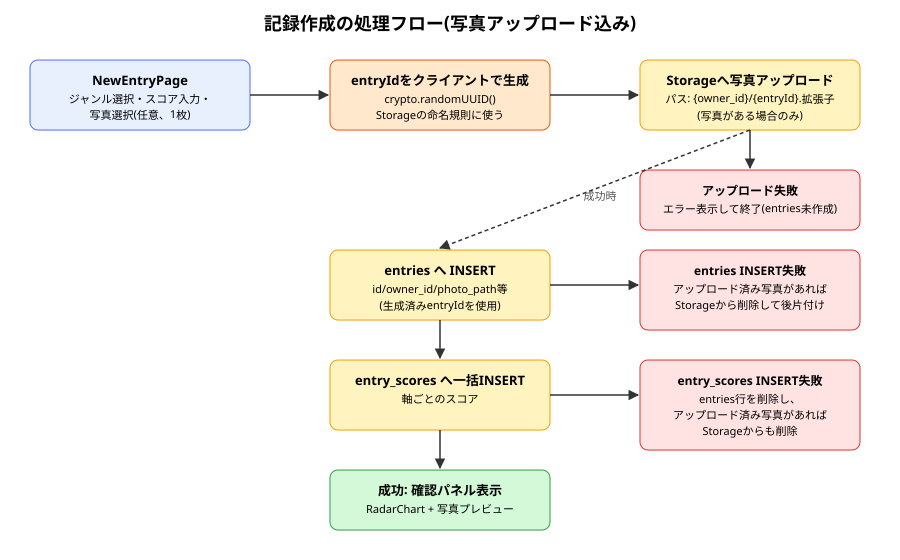
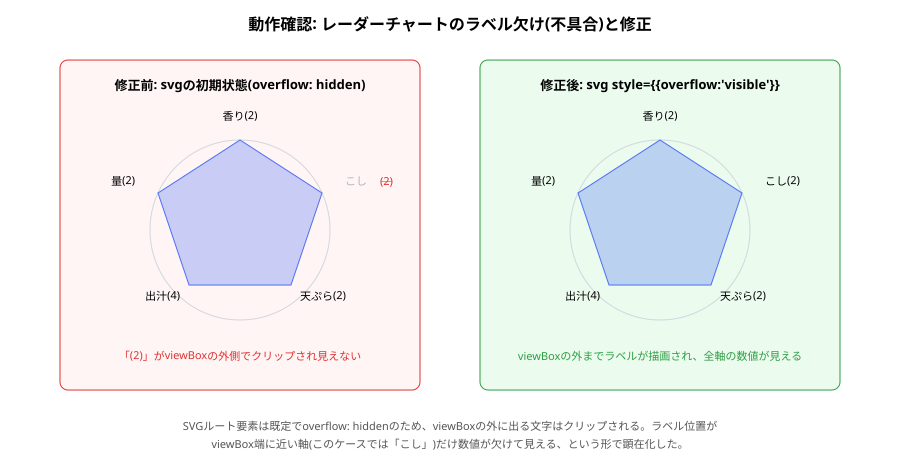

# entries 報告書

| 項目 | 内容 |
|---|---|
| 作成日 | 2026-09-01 |
| 対象コード | `src/components/RadarChart.tsx`, `src/pages/NewEntryPage.tsx` |
| 作成者 | Claude Code |
| 版数 | v1.1 |

## 改訂履歴
| 版 | 日付 | 変更内容 |
|---|---|---|
| v1.0 | 2026-09-01 | 初版作成 |
| v1.1 | 2026-09-01 | 写真アップロード機能を追加(Storage連携、entryIdのクライアント側生成、失敗時の後片付け拡張) |

---

## 1. 目的・対象読者

本報告書は、Ratefolioにおける記録作成機能(評価軸ごとのスコア入力、および自前実装のレーダーチャート表示)の実装内容と動作確認結果を共有することを目的とする。対象読者は、本プロジェクトの技術的な引き継ぎ先を想定する。

## 2. 背景

[[genres_report|ジャンル管理機能]]の設計時点で、評価結果をレーダーチャート(多角形)で表示する方針とし、そのために評価軸の数を3〜8個に制限した。本機能は、その方針を実際の記録作成画面として実装するものである。外部のグラフ描画ライブラリは追加せず、SVGと三角関数による自前実装とした。

## 3. レーダーチャート描画の前提知識

- **極座標→直交座標変換**: 角度$\theta$と半径$r$から、中心を基準にした座標$(r\cos\theta, r\sin\theta)$が求まる。
- **SVGのviewBoxとoverflow**: `viewBox`はSVG内部の座標系の表示範囲を決める。既定では`overflow: hidden`であり、この範囲外の描画はクリップされる(10節で詳述する不具合の原因)。

## 4. 仕様

### 4.1 入力仕様

| 項目名 | 型 | 説明 | 制約 |
|---|---|---|---|
| genreId | string | 記録対象のジャンルID | ユーザーが作成済みのジャンルから選択 |
| targetName | string | 対象名(店名等) | 空文字不可(トリム後) |
| entryDate | string(date) | 記録日 | 既定値は当日 |
| scores | Record\<axisId, number\> | 軸ごとのスコア | 1〜そのジャンルのscale_max |
| tagsInput | string | タグ(カンマ区切りの生入力) | 送信時に配列へ変換 |
| comment | string | コメント | 任意 |
| isPublic | boolean | 公開フラグ | 既定はfalse |
| photoFile | File \| null | 添付する写真 | 任意、1枚まで、`accept="image/*"` |

### 4.2 出力仕様

| 項目名 | 型 | 説明 |
|---|---|---|
| entries行 | DB行 | ジャンル名・scale_maxのスナップショットを含む記録本体 |
| entry_scores行(複数) | DB行 | 軸名スナップショットを含む、軸の数だけのスコア行 |
| RadarChartのSVG | UI | スライダー操作に応じてリアルタイムに再描画される多角形 |

### 4.3 制約条件・前提条件

- 写真は1枚のみ対応。Supabase Storageの非公開バケット`entry-photos`に、`{owner_id}/{entry_id}.拡張子`という命名規則でアップロードする(命名規則は[[supabase_schema_report|DBスキーマ報告書]]のStorageポリシー設計に合わせている)。
- レーダーチャートの軸数は3〜8個の前提であり、[[genres_report|ジャンル管理機能]]側で保証されている。

## 5. 使用ライブラリ・実行環境情報

| 項目 | 内容 |
|---|---|
| 言語/バージョン | TypeScript + React (Vite) |
| 主要ライブラリ | なし(グラフ描画は`@supabase/supabase-js`・React標準機能・生のSVGのみで実装。新規ライブラリの追加なし) |
| 実行環境 | Node.js / Vite開発サーバー、Supabaseプロジェクト |
| 実行方法 | `npm run dev` で `http://localhost:5173/entries/new` にアクセス(要ログイン・要ジャンル作成済み) |

## 6. アルゴリズム

1. ログイン中ユーザーの`genres`(埋め込みで`axes`含む)を取得する。
2. ユーザーがジャンルを選ぶと、各軸のスコアを既定値(中間程度)で初期化する。
3. スライダー操作のたびに`scores`(軸ID→スコアの対応表)を更新し、`RadarChart`へそのまま渡してリアルタイム再描画する。
4. 送信時、`entries`行の`id`をクライアント側で`crypto.randomUUID()`により先に生成する(Storageの命名規則に使うため)。
5. 写真が選択されていれば、生成した`id`を使って`{owner_id}/{entryId}.拡張子`というパスでStorageへアップロードする。失敗時はここで処理を中断する。
6. `entries`へ1行INSERTする(`id`は4で生成したもの、`photo_path`は5でアップロードしたパスまたは`null`)。失敗時は、5でアップロード済みの写真があればStorageから削除する。
7. 生成された`entries.id`を使って`entry_scores`へ軸の数だけ一括INSERTする。失敗時は、6の`entries`行と5の写真(あれば)を削除する。
8. 成功時は、送信直後のスコア・写真プレビューを確認パネルに表示する。

## 7. フローチャート



## 8. 実装

| 関数/コンポーネント | 役割 |
|---|---|
| `RadarChart` | 軸名・スコア・スケール上限を受け取り、SVGで多角形を描画する再利用可能コンポーネント |
| `angleForIndex` / `pointAt` | 軸のインデックスから角度・座標を計算する内部関数 |
| `NewEntryPage` | ジャンル選択・スコア入力フォームと、送信処理・確認パネルの表示 |
| `handlePhotoChange` | 選択された写真ファイルの状態更新と、ローカルプレビュー用URL(`URL.createObjectURL`)の発行/破棄 |

## 9. 出力結果

実際にブラウザから「蕎麦」ジャンル(5軸)の記録を作成し、動作確認を行った。その過程で、特定の軸のラベル数値がSVGの表示範囲外にクリップされて見えなくなる不具合を発見し、修正した。続けて写真を1枚添付して記録を作成したところ、Supabaseダッシュボードの「Storage → entry-photos」に、想定どおり`{owner_id}/{entryId}.拡張子`の形式でファイルが作成されていることを確認した。



## 10. 妥当性検証

| 検証項目 | 方法 | 結果 | 判定 |
|---|---|---|---|
| スライダー操作でレーダーチャートがリアルタイムに変化するか | 実際にブラウザでスライダーを動かし、チャートの再描画を目視確認 | 正しく再描画された | 合格 |
| 記録作成が`entries`/`entry_scores`両テーブルに正しく行を作るか | 実際に5軸の記録を作成し、確認パネルの表示内容(対象名・各軸スコア)を確認 | 正しく保存・表示された | 合格 |
| 全軸のラベルが正しく表示されるか | 実機で確認したところ、「こし」軸のスコア数値のみ表示されない不具合を発見 | 原因(SVGのoverflow: hiddenによるクリップ)を特定し、`overflow: visible`指定で修正。再確認により全軸で数値表示を確認 | 修正済み・合格 |
| 写真が実際にStorageへアップロードされるか | 実際にブラウザから写真付きで記録を作成し、Supabaseダッシュボード「Storage → entry-photos」でファイルの出現を確認 | `{owner_id}/{entryId}.拡張子`の命名規則どおりのフォルダ・ファイルが作成された | 合格 |
| 写真選択欄の分かりやすさ | ユーザーによる実機確認 | 標準の「ファイルを選択」ボタンが押せると分かりづらいとの指摘があり、Tailwindの`file:`バリアントでボタン風のスタイルに修正 | 修正後は未確認(次回確認予定) |
| 非公開データの非混入(RLS) | [[supabase_schema_report|DBスキーマ報告書]]の検証範囲。今回のentries/entry_scoresでの実データ複数アカウント比較検証は未実施 | 未実施 | 今後実施予定 |

## 11. 既知の制限事項・今後の課題

- 記録の一覧表示・検索・編集機能は未実装(今回は作成のみ)。写真の閲覧は、記録一覧UI実装時に非公開Storageバケットからの署名付きURL取得(`createSignedUrl`)等で対応する想定。
- レーダーチャートのラベルは、軸名が長い場合や画面幅が非常に狭い場合にレイアウトが崩れる可能性があり、実機での見た目確認は今回のテストケース(短い日本語の軸名、3〜5文字程度)の範囲にとどまる。
- `entries`・`entry_scores`・写真アップロードの一連の処理は真のDBトランザクションではなく、アプリ側の後片付け処理(逆順の削除)で整合性を保っている([[genres_report|ジャンル管理機能]]と同様の限界)。
- 作成直後の写真プレビューに使っている`URL.createObjectURL`のオブジェクトURLは、次の記録作成時や画面遷移時に明示的な破棄(`revokeObjectURL`)を行っていない箇所があり、厳密には軽微なメモリリークの余地がある。
- 写真ファイルの拡張子はファイル名から単純に取り出しており、拡張子のないファイル名や不正な形式への対応は最小限(既定で`jpg`扱い)。

## 12. 総括

外部ライブラリを追加せず、SVGと三角関数のみでレーダーチャートを自前実装し、評価軸ごとのスコア入力とリアルタイム連動する記録作成画面を実装した。実機確認で発見したSVGのクリップ不具合を特定・修正し、全軸のラベルが正しく表示されることを確認した。続けて写真アップロード機能を追加し、非公開Storageバケットへの命名規則どおりのアップロードと、失敗時の後片付け(写真・記録行のロールバック)を実装した。

## 13. 参考文献

- MDN Web Docs「SVG」「viewBox」
- 高校数学「三角関数と単位円」

---

## Appendix. コード実例

```tsx
const angleForIndex = (index: number) =>
  -Math.PI / 2 + (index * 2 * Math.PI) / axes.length

const pointAt = (radius: number, index: number) => {
  const angle = angleForIndex(index)
  return {
    x: center + radius * Math.cos(angle),
    y: center + radius * Math.sin(angle),
  }
}
```

```tsx
const entryId = crypto.randomUUID()
let photoPath: string | null = null

if (photoFile) {
  const ext = photoFile.name.split('.').pop() || 'jpg'
  photoPath = `${user.id}/${entryId}.${ext}`

  const { error: uploadError } = await supabase.storage
    .from('entry-photos')
    .upload(photoPath, photoFile, { contentType: photoFile.type })

  if (uploadError) {
    setErrorMessage(uploadError.message)
    setSubmitting(false)
    return
  }
}
```

（全文は `src/components/RadarChart.tsx`, `src/pages/NewEntryPage.tsx` を参照）
