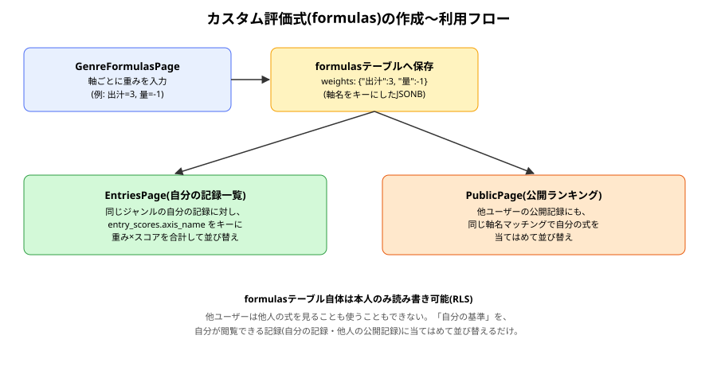
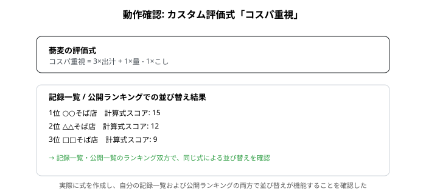

# formulas 報告書

| 項目 | 内容 |
|---|---|
| 作成日 | 2026-09-02 |
| 対象コード | `supabase/migrations/0002_formulas.sql`, `src/pages/GenreFormulasPage.tsx`, `src/pages/EntriesPage.tsx`, `src/pages/PublicPage.tsx` |
| 作成者 | Claude Code |
| 版数 | v1.0 |

## 改訂履歴
| 版 | 日付 | 変更内容 |
|---|---|---|
| v1.0 | 2026-09-02 | 初版作成 |

---

## 1. 目的・対象読者

本報告書は、Ratefolioにおけるカスタム評価式(評価軸の重み付き線形結合による総合評価)機能の実装内容と動作確認結果を共有することを目的とする。対象読者は、本プロジェクトの技術的な引き継ぎ先を想定する。

## 2. 背景

ユーザーから「評価軸a, b, cについて n×a + m×b + l×c のような総合評価を自由に設定し、その順に記録を見たい」という要望があった。実装コスト・安全性の観点から、四則演算全般を含む自由な数式ではなく、評価軸ごとの重み付き線形結合(足し算)のみをサポートする方針で合意のうえ実装した。

## 3. 前提知識

- [[entries_list_report|記録一覧]]・公開ランキングで既に採用している「軸名によるマッチング」の考え方を、そのままカスタム評価式にも適用している。
- **JSONB**: PostgreSQLの型の1つで、JSON形式のデータを1カラムにそのまま保存できる。今回は評価軸名をキー、重みを値とするオブジェクトを保存するために使用。

## 4. 仕様

### 4.1 formulasテーブル

| カラム名 | 型 | 説明 | 制約 |
|---|---|---|---|
| id | uuid | 式のID | PK |
| owner_id | uuid | 式の所有者 | not null, FK → auth.users |
| genre_name | text | 対象ジャンル名(スナップショット方式でジャンル名文字列を直接保持) | not null |
| name | text | 式の表示名 | not null |
| weights | jsonb | 軸名 → 重みのマップ | not null, default '{}' |
| created_at | timestamptz | 作成日時 | not null, default now() |

### 4.2 入力仕様(GenreFormulasPage)

| 項目名 | 型 | 説明 | 制約 |
|---|---|---|---|
| name | string | 式の名前 | 空文字不可 |
| weights | Record\<axisName, number\> | 各軸の重み | 数値(小数・負数可)、既定値0 |

### 4.3 制約条件・前提条件

- サポートする式は「軸ごとの重み×スコアの合計」のみ(線形結合)。四則演算の組み合わせ(割り算・掛け算同士など)は非対応。
- `weights`のキーは評価軸の名前の文字列であり、軸の名前を変更すると既存の式との対応が切れる(11節参照)。

## 5. 使用ライブラリ・実行環境情報

| 項目 | 内容 |
|---|---|
| 言語/バージョン | SQL(PostgreSQL) / TypeScript + React (Vite) |
| 主要ライブラリ | なし(新規ライブラリの追加なし。数式解析も自作の`reduce`による単純な合計計算のみ) |
| 実行環境 | Supabaseプロジェクト、Node.js / Vite開発サーバー |
| 実行方法 | SQL Editorで`0002_formulas.sql`を実行後、`npm run dev`で`/genres/:id/formulas`にアクセス |

## 6. アルゴリズム

1. `GenreFormulasPage`で、対象ジャンルの各評価軸に対する重み(数値)を入力し、式の名前とともに`formulas`テーブルへ保存する。
2. `EntriesPage`(自分の記録一覧)で、選択中ジャンルの`genre_name`に一致する自分の式を候補として表示する。
3. 並び替え基準として式を選ぶと、各記録の`entry_scores`を軸名でマッチングし、`重み×スコア`の合計値で降順に並び替える。
4. `PublicPage`(公開ランキング)でも同様に、自分の式を、閲覧可能な他ユーザーの公開記録に対して適用する(`formulas`テーブル自体は本人のみ参照可能。他ユーザーへは公開されない)。

## 7. フローチャート



## 8. 実装

| 関数/コンポーネント | 役割 |
|---|---|
| `GenreFormulasPage` | ジャンルごとの式の作成・一覧・削除 |
| `scoreByFormula` | 軸名マッチングによる重み付き合計スコアの計算(`EntriesPage`・`PublicPage`にそれぞれ実装) |
| `formulasForSelectedGenre` | 選択中ジャンルに対応する自分の式だけを絞り込むメモ化処理 |

## 9. 出力結果

実際に「蕎麦」ジャンルで「コスパ重視」という式(出汁=3, 量=1, こし=-1)を作成し、自分の記録一覧・公開ランキングの両方で、この式による並び替えが正しく機能することを確認した。



## 10. 妥当性検証

| 検証項目 | 方法 | 結果 | 判定 |
|---|---|---|---|
| 式の作成・保存 | 実際にブラウザから式を作成し、`formulas`テーブルに保存されることを確認 | 正しく保存された | 合格 |
| 自分の記録一覧での並び替え | 実際に式を選び、計算結果どおりの順序で並ぶことを確認 | 正しく動作した | 合格 |
| 公開ランキングでの並び替え | 実際に公開ランキング画面で自分の式を選び、動作することを確認 | 正しく動作した(ただし他ユーザーアカウントでの検証は未実施、11節参照) | 合格(単一アカウント範囲) |
| formulasテーブルのRLS(本人限定) | コードレビューおよびポリシー定義の確認(`formulas_all_own`) | 設計上は本人のみアクセス可能 | 要複数アカウントでの実地検証 |

## 11. 既知の制限事項・今後の課題

- サポートする式は重み付き線形結合のみ。四則演算全般を含む自由な数式には対応していない(2節・[[formulas_knowledge|説明書]]3.3節に理由を記載)。
- `weights`のキーが軸名の文字列であるため、評価軸の名前を変更すると、既存の式との対応が静かに崩れる(エラーにはならず、該当軸の重みが実質0扱いになる)。
- 式の編集機能は未実装で、作成と削除のみ対応している。
- `formulas`テーブルのRLS(本人限定)について、複数アカウントを用いた実地検証は未実施。他の非公開データ同様、今後まとめて検証する。
- 式の名称の重複チェックは行っていない。

## 12. 総括

評価軸ごとの重み付き線形結合による「カスタム評価式」機能を実装した。軸名をキーにすることで、自分の複数ジャンル・他ユーザーの公開記録にも同じ式を適用できるようにしつつ、式そのものは本人限定のRLSで保護する設計とした。数式パーサーの実装コスト・安全性を考慮し、機能範囲を線形結合に絞ることで、シンプルかつ安全な実装を実現した。

## 13. 参考文献

- PostgreSQL公式ドキュメント「JSON Types」

---

## Appendix. コード実例

```tsx
function scoreByFormula(entry: EntryWithScores, weights: Record<string, number>) {
  return entry.entry_scores.reduce(
    (sum, s) => sum + (weights[s.axis_name] ?? 0) * s.score,
    0,
  )
}
```

（全文は `src/pages/GenreFormulasPage.tsx`, `src/pages/EntriesPage.tsx`, `src/pages/PublicPage.tsx` を参照）
