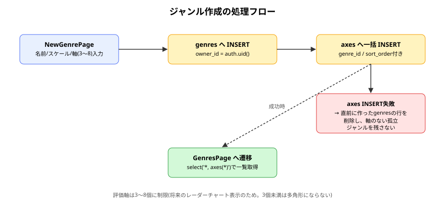
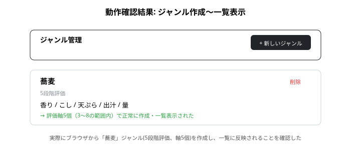

# genres 報告書

| 項目 | 内容 |
|---|---|
| 作成日 | 2026-09-01 |
| 対象コード | `src/pages/GenresPage.tsx`, `src/pages/NewGenrePage.tsx`, `src/components/RequireAuth.tsx` |
| 作成者 | Claude Code |
| 版数 | v1.0 |

## 改訂履歴
| 版 | 日付 | 変更内容 |
|---|---|---|
| v1.0 | 2026-09-01 | 初版作成 |

---

## 1. 目的・対象読者

本報告書は、Ratefolioにおけるジャンル管理機能(ジャンルの作成・一覧表示・削除、および評価軸の設定)の実装内容と動作確認結果を共有することを目的とする。対象読者は、本プロジェクトの技術的な引き継ぎ先を想定する。

## 2. 背景

Ratefolioの中核要件は「ジャンルごとに評価軸をn個自由に設定できる」ことである(引き継ぎ資料・CLAUDE.md参照)。加えて、本機能の設計段階でのユーザーとの合意により、評価結果を将来レーダーチャート(多角形)で描画する方針が決まった。多角形は最低3頂点を要するため、評価軸の数は3〜8個に制限することとした。

## 3. 認証・データ設計の前提知識

- 本機能は[[auth_report|認証機能]]で確立した`auth.uid()`と、[[supabase_schema_report|DBスキーマ]]の`genres`/`axes`テーブル・RLSポリシーの上に構築されている。
- **埋め込み取得(nested select)**: SupabaseのPostgREST APIは、外部キー関係にあるテーブルを`select('*, 子テーブル名(*)')`という記法で1回の問い合わせにまとめられる。

## 4. 仕様

### 4.1 入力仕様

| 項目名 | 型 | 説明 | 制約 |
|---|---|---|---|
| name | string | ジャンル名 | 空文字不可(トリム後) |
| scale_max | number | 評価スケール(何段階評価か) | 2〜10(プルダウン選択) |
| axisNames | string[] | 評価軸名のリスト | 3〜8個、各要素は空文字不可 |

### 4.2 出力仕様

| 項目名 | 型 | 説明 |
|---|---|---|
| genres行 | DB行 | `owner_id`/`name`/`scale_max`を持つ1行 |
| axes行 | DB行(複数) | `genre_id`/`name`/`sort_order`を持つ、軸の数だけの行 |
| 画面遷移 | - | 作成成功後は`/genres`(一覧)へ遷移 |

### 4.3 制約条件・前提条件

- 評価軸の数(3〜8)は現状アプリ側(React)のUIでのみ制限しており、DBレベルの制約は設けていない(11節参照)。
- ジャンル・軸の作成は、`genres`へのINSERTと`axes`への一括INSERTの2段階処理であり、真のDBトランザクションではない(6節・11節参照)。

## 5. 使用ライブラリ・実行環境情報

| 項目 | 内容 |
|---|---|
| 言語/バージョン | TypeScript + React (Vite) |
| 主要ライブラリ | `@supabase/supabase-js`、`react-router-dom`(いずれも既存導入済み) — 本機能のための新規ライブラリ追加はなし |
| 実行環境 | Node.js / Vite開発サーバー、Supabaseプロジェクト |
| 実行方法 | `npm run dev` で `http://localhost:5173/genres` にアクセス(要ログイン) |

## 6. アルゴリズム

1. `NewGenrePage`でジャンル名・評価スケール・評価軸名(3〜8個)を入力する。
2. 送信時、`genres`テーブルへ`owner_id = auth.uid()`として1行INSERTし、生成された`id`を取得する。
3. 取得した`id`を`genre_id`として、`axes`テーブルへ軸の数だけ一括INSERTする。
4. 3が失敗した場合、2で作成した`genres`の行を削除し、軸のない孤立ジャンルを残さない。
5. 成功時は`/genres`へ遷移し、`select('*, axes(*)')`でジャンルと軸をまとめて再取得・一覧表示する。
6. 削除操作は`genres`テーブルの行を`delete`するのみとし、DB側の外部キー設定(`axes`は`on delete cascade`、`entries.genre_id`は`on delete set null`)に後続処理を委ねる。

## 7. フローチャート



## 8. 実装

| 関数/コンポーネント | 役割 |
|---|---|
| `RequireAuth` | ログイン必須ルートの共通ガード。React Routerの入れ子ルートで複数ページに適用 |
| `NewGenrePage` | ジャンル名・評価スケール・評価軸(3〜8個、追加/削除可)の入力フォーム |
| `GenresPage` | 自分のジャンル一覧を、軸情報とあわせて表示。削除操作も提供 |

## 9. 出力結果

実際にブラウザから「蕎麦」ジャンル(5段階評価、軸5個: 香り/こし/天ぷら/出汁/量)を作成し、一覧画面に正しく反映されることを確認した。



## 10. 妥当性検証

| 検証項目 | 方法 | 結果 | 判定 |
|---|---|---|---|
| ジャンル作成が`genres`/`axes`両テーブルに正しく行を作るか | 実際にブラウザから5軸のジャンルを作成し、一覧画面での表示内容を確認 | ジャンル名・段階数・軸名(順序含む)がすべて正しく表示された | 合格 |
| 評価軸3〜8個の制限がUI上で機能するか | 3個未満での削除ボタン、8個到達時の追加ボタンの無効化を確認(コードレビューベース、実機での境界値操作は未実施) | ボタンの`disabled`条件は実装済み | 要実機での境界値確認 |
| 他ユーザーから自分のジャンルが見えないこと(RLS) | [[supabase_schema_report|DBスキーマ報告書]]の妥当性検証範囲。今回は実データでの複数アカウント比較検証は未実施 | 未実施 | 今後実施予定 |

## 11. 既知の制限事項・今後の課題

- 評価軸3〜8個の制限はDBレベルでは強制していない。現状は本画面経由でのみジャンルが作られるため実害はないが、将来的に他の経路が増えた場合はDBトリガー等での二重チェックを検討する。
- ジャンル作成(`genres`)と軸作成(`axes`)は真のDBトランザクションではなく、アプリ側での簡易的な後片付け(失敗時に`genres`行を削除)で整合性を保っている。より厳密にするにはPostgreSQL関数(RPC)化が必要。
- ジャンルの編集(名前・評価スケール・軸の追加/削除)機能は未実装で、現状は作成と削除のみ対応している。
- 非公開データの非混入(RLS)の実データ検証は、記録作成UI実装後にあわせて行う。

## 12. 総括

ジャンル・評価軸の作成/一覧/削除機能を実装し、実際のSupabaseプロジェクトに対して動作することを確認した。将来のレーダーチャート表示を見据え、評価軸の数を3〜8個に制限する設計判断を行った。また、複数ページで重複していたログイン必須判定を`RequireAuth`に共通化し、今後のページ追加を容易にした。

## 13. 参考文献

- Supabase公式ドキュメント「Fetching and updating related tables」
- React Router公式ドキュメント「Nested Routes」

---

## Appendix. コード実例

```tsx
const { error: axesError } = await supabase.from('axes').insert(
  trimmedAxes.map((axisName, index) => ({
    genre_id: genre.id,
    name: axisName,
    sort_order: index,
  })),
)

if (axesError) {
  await supabase.from('genres').delete().eq('id', genre.id)
  setErrorMessage(axesError.message)
  setSubmitting(false)
  return
}
```

（全文は `src/pages/NewGenrePage.tsx`, `src/pages/GenresPage.tsx`, `src/components/RequireAuth.tsx` を参照）
