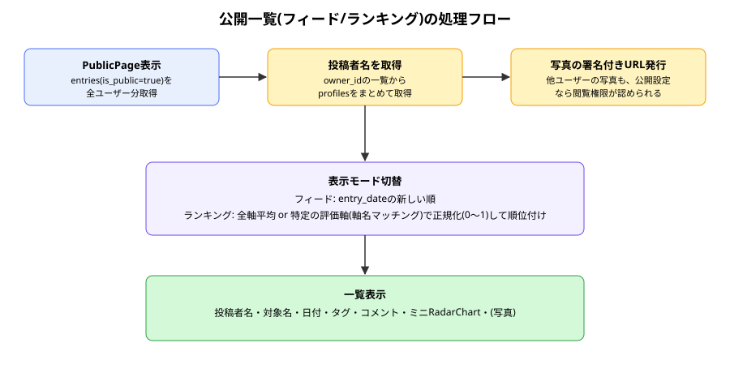
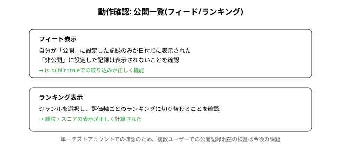

# public 報告書

| 項目 | 内容 |
|---|---|
| 作成日 | 2026-09-02 |
| 対象コード | `src/pages/PublicPage.tsx` |
| 作成者 | Claude Code |
| 版数 | v1.0 |

## 改訂履歴
| 版 | 日付 | 変更内容 |
|---|---|---|
| v1.0 | 2026-09-02 | 初版作成 |

---

## 1. 目的・対象読者

本報告書は、Ratefolioにおける公開一覧(フィード/ランキング切替)機能の実装内容と動作確認結果を共有することを目的とする。対象読者は、本プロジェクトの技術的な引き継ぎ先を想定する。

## 2. 背景

引き継ぎ資料の未決事項であった「公開一覧の見せ方」について、「フィードとランキングを切替可能にする」との決定に基づき実装した。あわせて、評価軸のスケールがジャンルによって異なる前提のもと、複数ジャンル・複数ユーザーの記録を公平に比較するための正規化ランキングを実装した。

## 3. 前提知識

- [[entries_list_report|記録一覧]]で確立した「RLSの許可範囲と実際に取得したい範囲は別」という考え方。
- **正規化**: 異なるスケールの値を共通の範囲(0〜1)に変換すること。

## 4. 仕様

### 4.1 入力仕様

| 項目名 | 型 | 説明 |
|---|---|---|
| viewMode | 'feed' \| 'ranking' | 表示モード |
| selectedGenreName | string | 絞り込み対象のジャンル名(空文字は「すべて」) |
| rankingBasis | 'overall' \| 'axis' \| 'formula' | ランキングの基準 |
| rankingAxisName | string | rankingBasisが'axis'のときの対象軸名 |
| keyword | string | キーワード検索文字列 |

### 4.2 出力仕様

| 項目名 | 型 | 説明 |
|---|---|---|
| visibleEntries | 配列 | 表示対象の公開記録(絞り込み・並び替え後) |
| authorNames | Record\<owner_id, display_name\> | 投稿者の表示名 |
| photoUrls | Record\<path, url\> | 写真の署名付きURL |

### 4.3 制約条件・前提条件

- 表示対象は`is_public = true`の記録のみ。
- ランキングの「特定の評価軸」「カスタム評価式」は、ジャンルを1つに絞っている場合のみ選択可能。

## 5. 使用ライブラリ・実行環境情報

| 項目 | 内容 |
|---|---|
| 言語/バージョン | TypeScript + React (Vite) |
| 主要ライブラリ | `@supabase/supabase-js`(既存導入済み) — 新規ライブラリの追加なし |
| 実行環境 | Node.js / Vite開発サーバー、Supabaseプロジェクト |
| 実行方法 | `npm run dev` で `http://localhost:5173/public` にアクセス(要ログイン) |

## 6. アルゴリズム

1. `is_public = true`の記録を`entry_scores`込みで全件取得する。
2. 取得結果から重複除去した`owner_id`一覧をもとに、`profiles`から投稿者の表示名をまとめて取得する。
3. 写真パスがある記録について、署名付きURLを一括発行する。
4. フィードモードでは日付降順、ランキングモードでは選択中の基準(全軸平均/特定軸/カスタム式)でスコアを計算し降順に並び替える。
5. ジャンル絞り込み・キーワード検索を、取得済みデータに対してクライアント側で適用する。

## 7. フローチャート



## 8. 実装

| 関数/コンポーネント | 役割 |
|---|---|
| `PublicPage` | 公開記録の取得、投稿者名・写真URLの解決、フィード/ランキング表示 |
| `rankScoreOf` | ランキング基準(全軸平均/特定軸/カスタム式)に応じたスコア計算 |

## 9. 出力結果

自分のアカウントで公開・非公開の記録を作成し、フィードには公開分のみが表示されること、ランキングでジャンル・評価軸を選ぶと正しく順位付けされることを確認した。



## 10. 妥当性検証

| 検証項目 | 方法 | 結果 | 判定 |
|---|---|---|---|
| 非公開記録が一覧に含まれないか | 自分のアカウントで公開/非公開の記録を両方作成し、フィードに公開分のみ表示されることを確認 | 正しく絞り込まれた | 合格 |
| フィード/ランキングの切替 | 実際にブラウザで両モードを切り替えて確認 | 正しく切り替わった | 合格 |
| 評価軸ランキングの計算 | 特定の軸を選び、スコア順に並ぶことを確認 | 正しく計算された | 合格 |
| 複数ユーザー間での公開記録の混在表示 | 単一テストアカウントのため未実施 | 未実施 | 今後実施予定 |

## 11. 既知の制限事項・今後の課題

- 複数ユーザーアカウントを用いた、実際の公開記録混在表示の検証は未実施。
- 投稿者名の取得は`profiles`への別クエリで行っており、記録件数・投稿者数が非常に多い場合はやや非効率(11節に記載の一般的なスケール限界と同様)。
- 署名付きURLの有効期限(1時間)に関する制限は[[entries_list_report|記録一覧報告書]]と同様。

## 12. 総括

公開記録のフィード表示とランキング表示を切り替えられる画面を実装した。RLSの許可範囲から「公開のみ」を明示的に絞り込む設計、異なる評価スケールを正規化して比較するランキング計算など、これまでの機能で確立した設計原則を一貫して適用した。

## 13. 参考文献

- Supabase公式ドキュメント「Fetching in bulk with in()」

---

## Appendix. コード実例

```tsx
const avg =
  entry.entry_scores.reduce((sum, s) => sum + s.score, 0) /
  entry.entry_scores.length
return avg / entry.scale_max
```

（全文は `src/pages/PublicPage.tsx` を参照）
