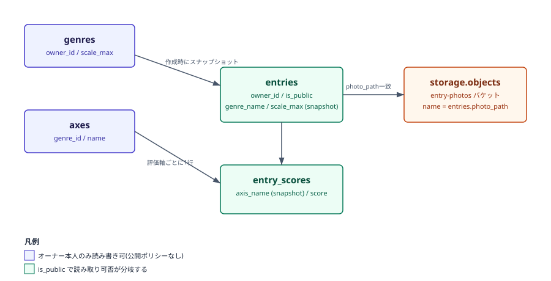
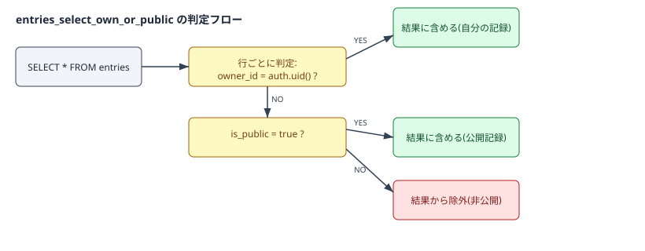

# supabase_schema 報告書

| 項目 | 内容 |
|---|---|
| 作成日 | 2026-08-09 |
| 対象コード | `supabase/migrations/0001_init.sql` |
| 作成者 | Claude Code |
| 版数 | v1.1 |

## 改訂履歴
| 版 | 日付 | 変更内容 |
|---|---|---|
| v1.0 | 2026-08-09 | 初版作成 |
| v1.1 | 2026-09-01 | Obsidian用YAMLフロントマターを追加 |

---

## 1. 目的・対象読者

本報告書は、Ratefolioのバックエンド(Supabase/PostgreSQL)における初期スキーマおよびRow Level Security(RLS)設計の共有を目的とする。対象読者は、本プロジェクトの技術的な引き継ぎ先、または同種の設計を参照したい技術者を想定する。

## 2. 背景

Ratefolioは、ジャンル・評価軸をユーザーが自由に定義し、記録単位で公開/非公開を切り替えられる個人向け評価記録サービスである。要件上、非公開データが他ユーザーのクエリに一切混入しないことが必須であり、アプリケーション層のバグに依存しない防御(データベースレベルのアクセス制御)が求められた。これに応える基盤として、PostgreSQLのRLS機能を持つSupabaseを採用した。

## 3. 設計・アクセス制御の前提知識

- **Row Level Security (RLS)**: PostgreSQLの機能。テーブルの行ごとに、SQL条件式(ポリシー)に基づいて読み書き可否を強制する。アプリケーション層を経由せず、DBエンジン自身が適用する。
- **`auth.uid()`**: Supabase Authが提供する関数。リクエストを行っている認証済みユーザーのUUIDを返す。未認証時は`null`。
- **スナップショット方式**: 参照先(ジャンル・評価軸)の値を、参照元(記録)の作成時点でコピーして保持する設計。RLSの単純化とデータの不変性(過去の記録が後から変わらないこと)を両立する。

## 4. 仕様

### 4.1 テーブル一覧

| テーブル | 役割 | 公開/非公開の扱い |
|---|---|---|
| `profiles` | ユーザーの表示名 | 全体公開(表示名のみ) |
| `genres` | ユーザー定義のジャンル | 常にオーナー本人のみ |
| `axes` | ジャンルに紐づく評価軸(n個) | 常にオーナー本人のみ(genres経由) |
| `entries` | 1件の記録。公開/非公開の一元管理点 | `is_public`により分岐 |
| `entry_scores` | 記録×評価軸ごとのスコア | 親entryの`is_public`に追従 |
| `storage.objects`(`entry-photos`バケット) | 記録写真 | `entries.photo_path`一致により親entryに追従 |

### 4.2 主要カラム(entries)

| 項目名 | 型 | 説明 | 制約 |
|---|---|---|---|
| owner_id | uuid | 記録の所有者 | not null, FK → auth.users |
| genre_id | uuid | 作成時点のジャンル参照 | FK → genres, on delete set null |
| genre_name | text | ジャンル名のスナップショット | not null |
| scale_max | smallint | 評価スケール(段階数)のスナップショット | not null |
| target_name | text | 対象名(店名・書名など) | not null |
| photo_path | text | Storage上のオブジェクトパス | nullable |
| tags | text[] | タグ(複数・自由入力) | not null, default '{}' |
| is_public | boolean | 公開フラグ | not null, default false |

### 4.3 制約条件・前提条件

- `genres.scale_max`は2〜10の範囲に制約している(1段階評価や過大な段階数を防止)。
- Storageのオブジェクトパスは`{owner_id}/{entry_id}.拡張子`という命名規約を前提とし、RLSポリシーはこの規約に依存する。命名規約が崩れるとポリシーが正しく機能しない点に注意。

## 5. 使用ライブラリ・実行環境情報

| 項目 | 内容 |
|---|---|
| 言語/バージョン | SQL (PostgreSQL、Supabase提供版) |
| 主要ライブラリ | pgcrypto拡張(UUID生成用) |
| 実行環境 | Supabaseプロジェクト(SQL Editor経由で実行) |
| 実行方法 | Supabaseダッシュボード → SQL Editor に`0001_init.sql`の内容を貼り付けて実行 |

## 6. アルゴリズム(適用手順)

1. Supabaseプロジェクトを作成する。
2. SQL Editorで`supabase/migrations/0001_init.sql`を実行する。
3. `profiles` / `genres` / `axes` / `entries` / `entry_scores`テーブルとRLSポリシー、`entry-photos`ストレージバケットとそのポリシーが作成されることを確認する。
4. フロントエンドの環境変数(`VITE_SUPABASE_URL` / `VITE_SUPABASE_ANON_KEY`)にプロジェクトの接続情報を設定する。

## 7. フローチャート

テーブル間の関連とアクセス制御の考え方を以下に示す。



## 8. 実装

| 関数/オブジェクト | 役割 |
|---|---|
| `handle_new_user()` (トリガー関数) | 新規ユーザー登録時に`profiles`へ1行自動作成する |
| `set_updated_at()` (トリガー関数) | `entries`更新時に`updated_at`を自動更新する |
| `entries_select_own_or_public` (ポリシー) | 記録の公開/非公開判定の中心となるRLSポリシー |
| `entry_photos_select_own_or_public` (ポリシー) | 写真の閲覧可否を`entries.is_public`と連動させるポリシー |

## 9. 出力結果

`entries`テーブルに対するSELECT時、RLSがどのように行をフィルタするかを以下に示す。



## 10. 妥当性検証

| 検証項目 | 方法 | 結果 | 判定 |
|---|---|---|---|
| SQL構文の妥当性 | Supabase SQL Editorでの実行を想定したレビュー(実プロジェクト未作成のため未実行) | 構文上のエラーなし | 要実プロジェクトでの最終確認 |
| RLS方針の一貫性 | 各テーブルのポリシーがCLAUDE.mdの要件(非公開データの非混入)を満たすか机上で確認 | `entries`/`entry_scores`/`storage.objects`とも、オーナー本人 or 公開時のみ許可となっている | 合格 |

本番のSupabaseプロジェクト未作成のため、実データでの動作確認(実際にRLSが機能することの検証)は未実施である。今後、テストアカウントを2つ用意し、一方が非公開データにアクセスできないことを実際に確認する必要がある。

## 11. 既知の制限事項・今後の課題

- Storageのポリシーは「パスの先頭がowner_idであること」という命名規約に依存している。アプリ側のアップロード処理でこの規約を必ず守る必要があり、規約が崩れると意図しないアクセス制御になり得る。
- `genres`削除時に`entries.genre_id`が`null`になる設計のため、削除後の一覧画面で「ジャンル不明」の記録をどう表示するかはUI側で別途考慮が必要。
- 現時点でSupabaseプロジェクトが未作成のため、本スキーマは未適用・未検証である。

## 12. 総括

Ratefolioの中核要件である「非公開データの非混入」を、DBレベルのRow Level Securityで担保するスキーマを設計した。ジャンル・評価軸を常にオーナー限定とし、記録作成時にスナップショットを取ることで、公開判定を`entries.is_public`の1点に集約し、ポリシーの複雑化とそれに伴う事故のリスクを抑える構成とした。

## 13. 参考文献

- Supabase公式ドキュメント: Row Level Security
- PostgreSQL公式ドキュメント: 5.9. Row Security Policies

---

## Appendix. コード実例

```sql
create policy "entries_select_own_or_public"
  on public.entries for select
  using (auth.uid() = owner_id or is_public = true);
```

（全文は `supabase/migrations/0001_init.sql` を参照）
