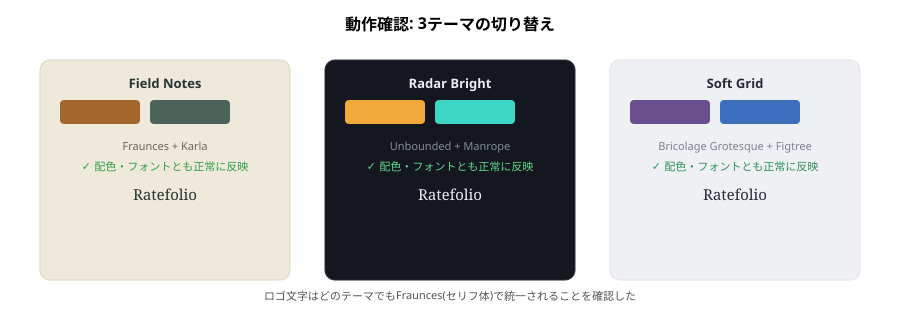

# theme 報告書

| 項目 | 内容 |
|---|---|
| 作成日 | 2026-09-02 |
| 対象コード | `src/index.css`, `src/contexts/ThemeContext.tsx`, `src/components/ThemeSwitcher.tsx`, `src/components/AppLayout.tsx`, `src/components/RadarChart.tsx`, `index.html`、および全ページのスタイル |
| 作成者 | Claude Code |
| 版数 | v1.0 |

## 改訂履歴
| 版 | 日付 | 変更内容 |
|---|---|---|
| v1.0 | 2026-09-02 | 初版作成 |

---

## 1. 目的・対象読者

本報告書は、Ratefolioにおける3種類の配色・フォントを切り替えられるテーマ機能の実装内容と動作確認結果を共有することを目的とする。対象読者は、本プロジェクトの技術的な引き継ぎ先を想定する。

## 2. 背景

主要機能の実装完了後、見た目の作り込み(デザインパス)を行う段階で、3案のモックアップ(Field Notes/Radar Bright/Soft Grid)を提示した。ユーザーから「1つに絞らず、ユーザー自身が選べるようにしたい」との要望があり、固定デザインではなくテーマ切り替え機能として実装する方針となった。あわせて、ブランド名(ロゴ)のフォントはテーマに関わらず統一したいという要望も反映している。

## 3. 前提知識

- **CSSカスタムプロパティ(デザイントークン)**: `--rf-bg`のような変数名で色・フォントを管理し、`var(--rf-bg)`で参照する仕組み。
- **属性セレクタによるテーマ切り替え**: `<html>`要素の`data-app-theme`属性の値に応じて、CSS側で異なる変数セットを適用する。

## 4. 仕様

### 4.1 テーマ一覧

| テーマ名 | 配色の方向性 | 表示/背景 | 見出し書体 | 本文書体 | 数値書体 |
|---|---|---|---|---|---|
| field-notes | 記録帳のような温かみ | ライト(石灰色) | Fraunces | Karla | IBM Plex Mono |
| radar-bright | データが主役のダーク基調 | ダーク(墨色) | Unbounded | Manrope | IBM Plex Mono |
| soft-grid | 静かで見通しの良いミニマル | ライト(霧グレー) | Bricolage Grotesque | Figtree | Space Mono |

### 4.2 CSS変数一覧(抜粋)

| 変数名 | 役割 |
|---|---|
| --rf-bg / --rf-surface | ページ背景 / カード等の面の背景 |
| --rf-text / --rf-muted | 本文色 / 補助テキスト色 |
| --rf-accent / --rf-accent-2 | 主要アクセント(ボタン・リンク・チャート) / 補助アクセント |
| --rf-border / --rf-chip-bg / --rf-chip-text | 罫線 / タグチップの背景・文字色 |
| --rf-font-display / --rf-font-body / --rf-font-mono | 見出し / 本文 / 数値用フォント |
| --rf-font-logo | ロゴ専用フォント(全テーマ共通、上書きされない) |
| --rf-chart-grid | レーダーチャートの目盛り線色 |

### 4.3 制約条件・前提条件

- テーマの保存先はブラウザの`localStorage`のみで、複数端末間の同期は行わない。
- テーマはOSのライト/ダーク設定(`prefers-color-scheme`)とは独立しており、ユーザーが明示的に選択する。

## 5. 使用ライブラリ・実行環境情報

| 項目 | 内容 |
|---|---|
| 言語/バージョン | TypeScript + React (Vite) / CSS |
| 主要ライブラリ | なし。Google Fonts(Fraunces, Karla, IBM Plex Mono, Unbounded, Manrope, Bricolage Grotesque, Figtree, Space Mono)をCDN経由で読み込み、新規JSライブラリの追加はなし |
| 実行環境 | Node.js / Vite開発サーバー |
| 実行方法 | `npm run dev` で `http://localhost:5173` にアクセスし、ヘッダーのボタンでテーマを切り替える |

## 6. アルゴリズム

1. `index.html`の初期化スクリプトが、Reactの起動前に`localStorage`からテーマ名を読み取り、`<html data-app-theme="...">`にセットする(未保存/不正値は`field-notes`にフォールバック)。
2. `index.css`の`[data-app-theme="..."]`ブロックが、その属性値に応じたCSS変数一式を`:root`へ適用する。
3. 各画面は、色・フォントの指定をTailwindの標準色クラスではなく、`rf-*`ユーティリティクラス(`.rf-surface`, `.rf-btn-primary`等)またはTailwindの任意の値記法(`bg-[var(--rf-x)]`)で行う。
4. `RadarChart`は、SVGの`stroke`/`fill`属性に直接`var(--rf-accent, ...)`等を指定し、テーマの状態を意識せず自動的に配色へ追従する。
5. ユーザーが`ThemeSwitcher`でテーマを選ぶと、`ThemeContext`が`data-app-theme`属性と`localStorage`を更新し、CSSの再適用によって画面全体の見た目が切り替わる。

## 7. フローチャート



## 8. 実装

| 関数/コンポーネント | 役割 |
|---|---|
| `ThemeProvider` / `useTheme` | 選択中テーマの状態管理と、`data-app-theme`属性・`localStorage`の同期 |
| `ThemeSwitcher` | ヘッダーに設置する3択のテーマ切り替えボタン |
| `index.css`の`[data-app-theme]`ブロック | テーマごとの実際の色・フォント定義 |
| `RadarChart`(修正) | チャートの配色をCSS変数経由でテーマに追従させる |

## 9. 出力結果

実際にブラウザで3つのテーマを切り替え、全画面(ジャンル管理・記録一覧・記録作成・公開一覧・レーダーチャート)の配色・フォントが正しく切り替わること、ロゴ文字のフォントがテーマに関わらず統一されていること、ページ再読み込み後も選択が維持されることを確認した。



## 10. 妥当性検証

| 検証項目 | 方法 | 結果 | 判定 |
|---|---|---|---|
| 3テーマの切り替えが全画面に反映されるか | 実際にブラウザで各画面を巡り、切り替えを確認 | 正しく反映された | 合格 |
| ロゴフォントがテーマに関わらず統一されているか | 実際に3テーマそれぞれでロゴの見た目を確認 | 常にFrauncesで表示された | 合格 |
| ページ再読み込み後もテーマが維持されるか | 実際にテーマを変更後、再読み込みして確認 | 選択したテーマが維持された | 合格 |
| 初期表示時のちらつき(FOUC)が発生しないか | 目視確認 | 明らかなちらつきは確認されなかった(定量的な計測は未実施) | 合格(簡易確認) |

## 11. 既知の制限事項・今後の課題

- テーマの保存は`localStorage`のみで、複数端末・複数ブラウザ間では同期されない。
- 用意されているテーマは3種類の固定パターンのみで、ユーザーによる自由な配色カスタマイズには対応していない。
- OSのライト/ダーク設定とは独立しており、自動追従は行わない(意図的な設計)。
- レーダーチャートの色以外にも、フォームの一部要素(タブ切り替えボタン等)はTailwindクラスではなくインラインスタイルで実装しており、Tailwindの一貫性という観点ではやや例外的な箇所が残っている。

## 12. 総括

CSSカスタムプロパティを用いたデザイントークンの仕組みにより、3種類のテーマをユーザーが自由に切り替えられる機能を実装した。React側の状態管理とHTML側の初期化スクリプトを組み合わせることで、選択の永続化と初期表示のちらつき防止を両立した。ブランドロゴのフォントは独立した変数でテーマの影響を受けないようにし、ブランドの一貫性とテーマごとの個性を両立させる設計とした。

## 13. 参考文献

- MDN Web Docs「Using CSS custom properties」
- Tailwind CSS公式ドキュメント「Arbitrary values」

---

## Appendix. コード実例

```css
[data-app-theme="radar-bright"] {
  --rf-bg: #14171f;
  --rf-surface: #1c202c;
  --rf-accent: #f2a93b;
  --rf-font-display: "Unbounded", sans-serif;
}
```

（全文は `src/index.css`, `src/contexts/ThemeContext.tsx` を参照）
